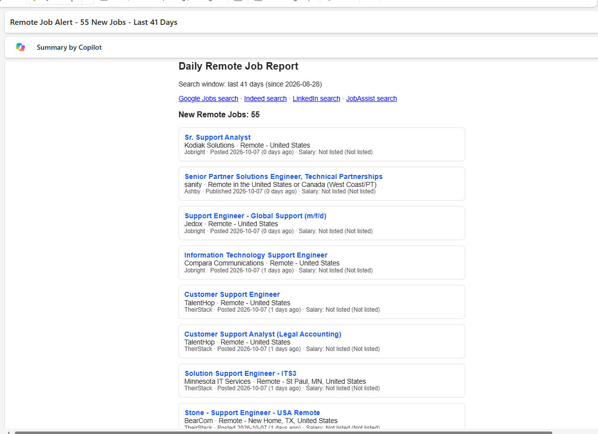

# Job Alert Bot

[](https://opensource.org/licenses/MIT)

A small Python script that looks through company job boards and a few job sites for **remote, US-eligible** jobs matching the titles you choose, then emails you a daily list of **only the new ones**.

It was built for support / solutions-type roles, but the title list, pay floor, and companies are all settings at the top of `ats_job_alert.py`, so you can aim it at any field.

## Requirements

- No installs. It uses only Python's built-in libraries (Python 3.10 or newer).
- Powershell
- Your google email and app password
- Optional: Theirstack API keys
 ```bash
  Note: Your goggle app password and API key are never stored in the code. They come from environment variables stored locally on your PC.
 ```

## What it searches

| Source | How | Needs |
|---|---|---|
| Greenhouse, Lever, Ashby company boards | Public job-board APIs, one request per company | A list of company names (you edit it) |
| Workable | Workable's public job search, plus optional company boards | Nothing |
| Remotive, Remote OK, We Work Remotely | Their public feeds | Nothing |
| TheirStack (optional) | Its official API, title search across many companies | A free API key (small monthly credit allowance) |
| Jobright, JobAssist (optional) | **You** save your own results from your own logged-in browser; the script reads that file | Your own accounts |

## Filters it applies

Title matches your keywords, remote only, US-eligible region, posted within `DAYS_BACK` days, pay at or above `MIN_SALARY` when a pay range is listed, and not already emailed to you. Roles marked hybrid or on-site, or tied to non-US regions, are dropped.

These filters are heuristics, so always open the posting and check before you apply.

## Quick start (about 10 minutes)

**1. Get a Gmail App Password.
** Turn on 2-Step Verification for your Google account, then create an App Password at <https://myaccount.google.com/apppasswords>. It is 16 characters. This is *not* your normal password.

**2. Set three environment variables.**

Windows PowerShell (this window only):
```powershell
$env:JOB_ALERT_EMAIL_FROM = "you@gmail.com"
$env:JOB_ALERT_EMAIL_PASSWORD = "your16characterapppassword"
$env:JOB_ALERT_EMAIL_TO = "you@gmail.com"      # comma-separate several; defaults to FROM
```
To keep them, use `setx NAME "value"` (no equals sign), then open a new terminal.

Mac / Linux:
```bash
export JOB_ALERT_EMAIL_FROM="you@gmail.com"
export JOB_ALERT_EMAIL_PASSWORD="your16characterapppassword"
export JOB_ALERT_EMAIL_TO="you@gmail.com"
```

**3. Try it without sending anything.**
```bash
python ats_job_alert.py --dry-run -v
```
`-v` also shows why each job was dropped. When it looks right, run it for real:
```bash
python ats_job_alert.py
```
The first real run emails everything currently open. After that you only get new jobs.

## Make it yours

Open `ats_job_alert.py` and edit the SETTINGS section near the top:

- `TITLE_KEYWORDS`: the job titles you want.
- `MIN_SALARY`, `DAYS_BACK`: pay floor and how far back to look.
- `INCLUDE_SOLUTIONS_ENGINEERS`: `False` drops pre-sales "Solutions Engineer" roles.
- `COMPANIES` (Greenhouse), `ASHBY_BOARDS`, `LEVER_BOARDS`, `WORKABLE_BOARDS`: the companies to follow. The name is the last part of the company's job-board address, for example `boards.greenhouse.io/NAME`, `jobs.ashbyhq.com/NAME`, `jobs.lever.co/NAME`, `apply.workable.com/NAME`.

To discover companies that fit your titles, run `python find_boards.py`. It checks a built-in list of names (or your own file, one name per line: `python find_boards.py my_names.txt`) and prints lines you can paste into the lists above.

## Optional extras

**Jobright / JobAssist.** These sites need your login, so the script never connects to them. Instead, open your results page, press F12, open the Network tab, find the request that returns the job list, right-click it, choose Copy then Copy response, and save it as `jobright.json` or `jobassist.json` next to the script. Re-save it every few days. Both files are in `.gitignore`. **Never commit them or share them**: they contain details tied to your account.

`python jobright_boards.py jobright.json` lists company boards found in an export.

**TheirStack.** Get a key at theirstack.com and set `THEIRSTACK_API_KEY`. Each job it returns costs one credit, so the script caps requests, remembers jobs it already paid for, and reuses recent results. Without a key this source is simply skipped.

## Run it every day

**Your own computer:** Windows Task Scheduler or `cron`, running `python ats_job_alert.py` once a day.

**GitHub Actions (free, runs even when your computer is off):**
1. Use this repository as a template, or fork it, and **make your copy private**. The job saves its "already sent" memory (`seen_jobs.txt`, `jobs.csv`) back to the repo, which would list the jobs you were sent.
2. In Settings, Secrets and variables, Actions, add `JOB_ALERT_EMAIL_FROM`, `JOB_ALERT_EMAIL_PASSWORD`, `JOB_ALERT_EMAIL_TO`, and optionally `THEIRSTACK_API_KEY`.
3. Open the Actions tab and run "Daily job alert" once by hand to test it.

Jobright / JobAssist exports can't be used from GitHub Actions, because you must not commit them.

## Files it creates

| File | Purpose |
|---|---|
| `seen_jobs.txt`, `jobs.csv` | Jobs already emailed (don't delete: they stop repeats) |
| `job_alert.log` | Run log |
| `theirstack_usage.json`, `theirstack_cache.json` | TheirStack credit tracking and saved results |

All of them are listed in `.gitignore`.

## Limits and good manners

- It is built for **US remote** jobs. Other regions would need edits to the region filters.
- Job sites change. If a source stops returning jobs, check the log line for that source.
- The Workable search uses an undocumented public endpoint that could change.
- Use it for your own job search, at a gentle pace: one run a day is plenty. Respect each site's terms.
- FlexJobs is paid and has no public job-seeker API, so it is not supported.
- Not affiliated with Greenhouse, Lever, Ashby, Workable, TheirStack, Jobright, JobAssist, or any listed employer.

## Preview / Screenshot / Walkthrough Video


## License

This project is licensed under the MIT License - see the [MIT](LICENSE) file for details.


## Note
`Feel free to modify this script to better suit your job search. All the best and pray it helps you land that dream job! 🙏`
